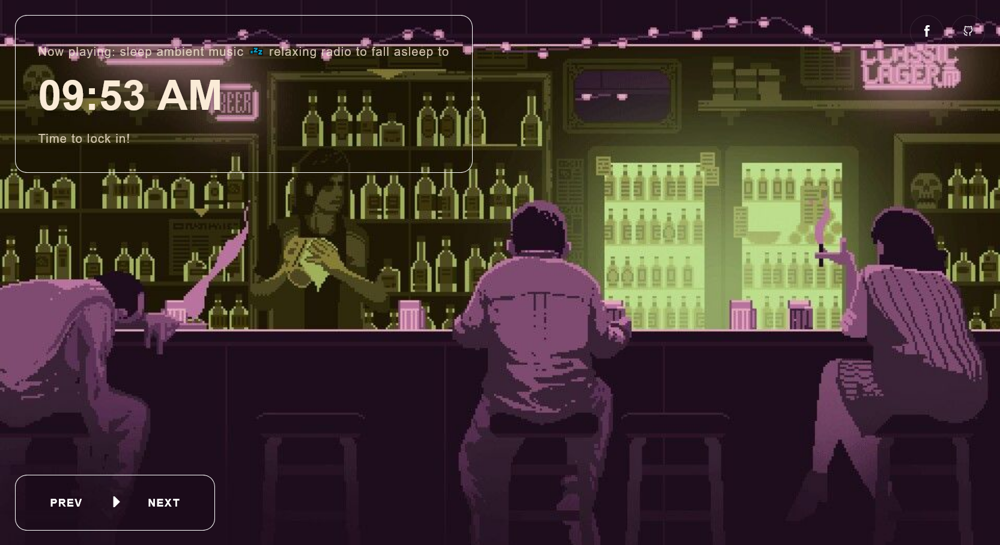

# Lo-Fi Radio 24/7

[](https://lofi-experiment.netlify.app)
<!-- Replace the URL below with the path to your actual image (e.g., ./screenshot.png) -->


A minimalist, lightweight website to play 24/7 lofi music for study, work, or relaxation.

## Built With
*   HTML5, CSS3, JavaScript
*   Youtube iframe API

## Getting Started

### Prerequisites
Make sure you have [Node.js](https://nodejs.org/) installed if your project requires a build step. If this is a static site, you just need a web server (or you can host it on GitHub Pages).

### Installation
1.  **Clone the repository:**
    ```bash
    git clone [https://github.com/git-notion/lofi-radio-24-7.git](https://github.com/git-notion/lofi-radio-24-7.git)
    ```
2.  **Navigate to the project folder:**
    ```bash
    cd lofi-radio-24-7
    ```
3.  **Install dependencies** (if applicable):
    ```bash
    npm install
    ```

## Usage
*   **To run locally:** [Include command, e.g., `npm start` or just open `index.html` in your browser].
*   **Deployment:** This project can be easily hosted on [GitHub Pages](https://pages.github.com/), [Vercel](https://vercel.com/), or [Netlify](https://www.netlify.com/).

## 🤝 Contributing
Contributions are welcome! If you have suggestions for improvements or want to add new features:
1.  Fork the repo.
2.  Create your feature branch (`git checkout -b feature/AmazingFeature`).
3.  Commit your changes (`git commit -m 'Add some AmazingFeature'`).
4.  Push to the branch (`git push origin feature/AmazingFeature`).
5.  Open a Pull Request.

## License
This project is licensed under the MIT License - see the [LICENSE](LICENSE) file for details.
